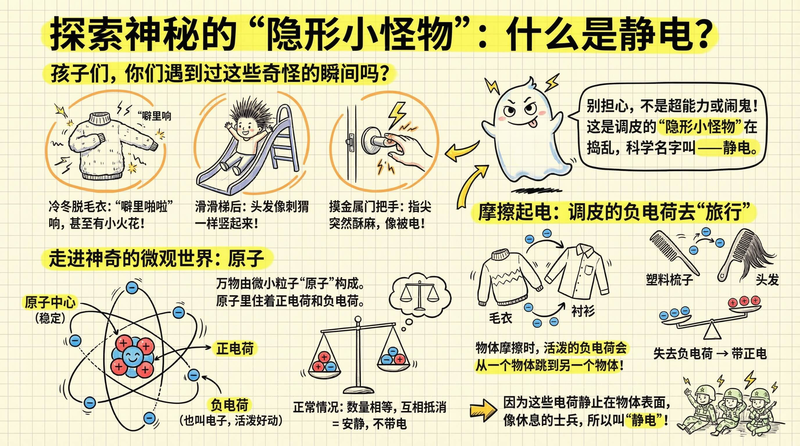
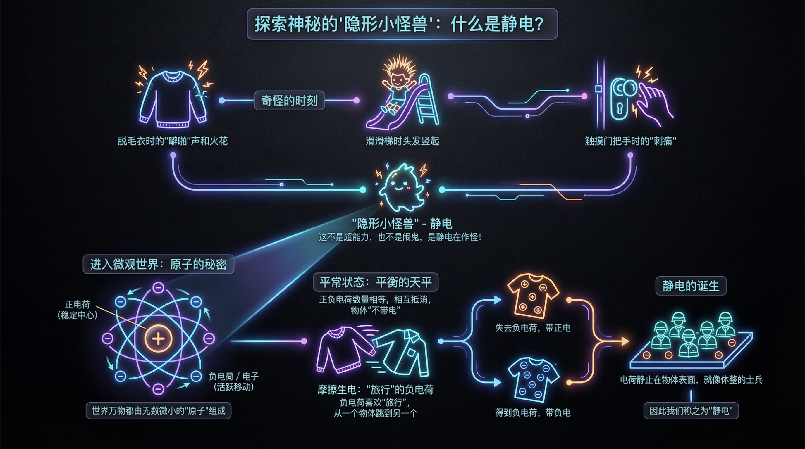
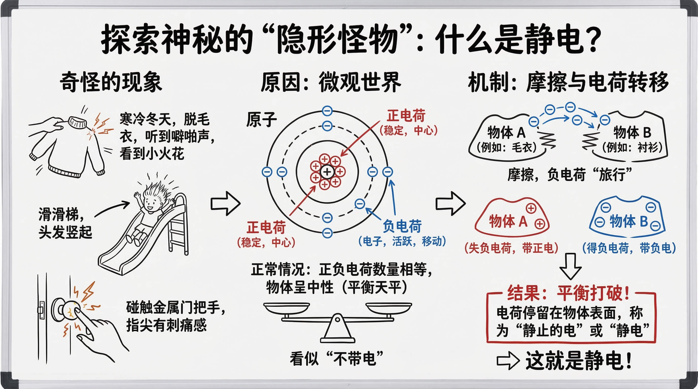
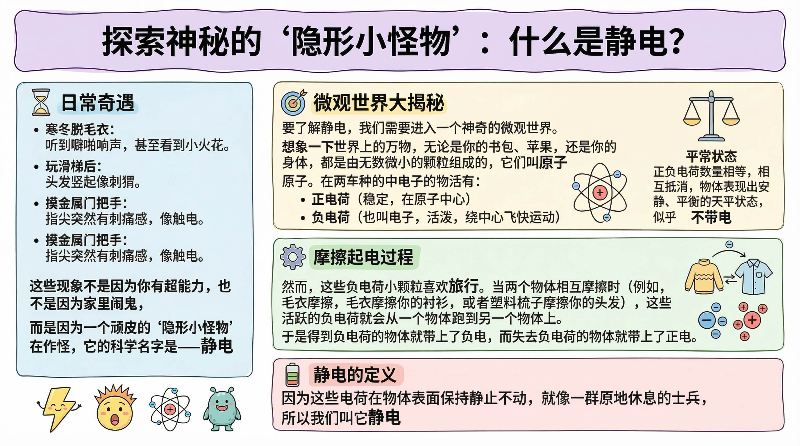
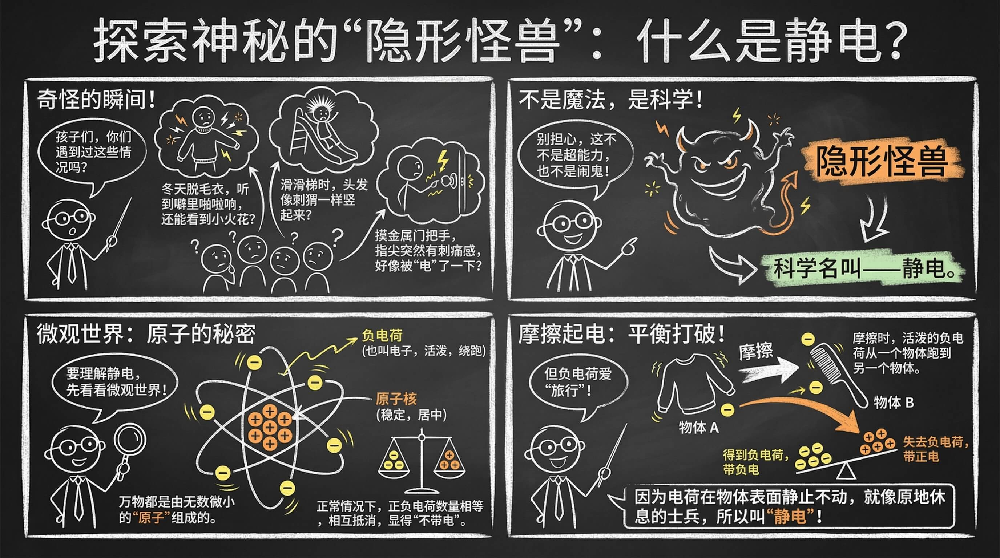
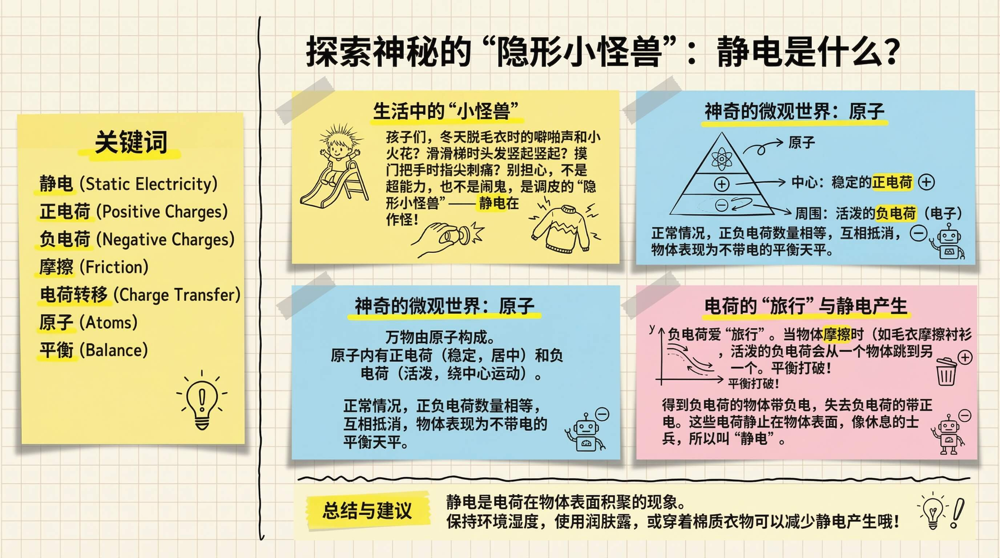
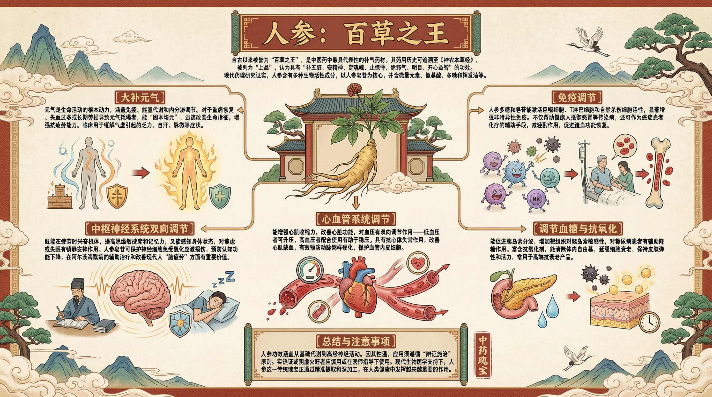
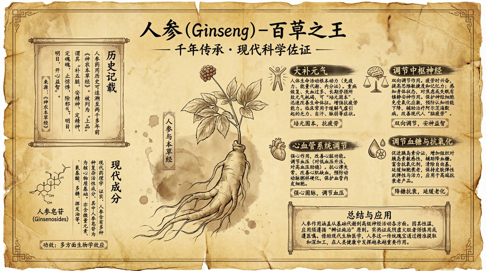

# Nano Info

一个帮你快速生成精美信息图的小工具。

## 在线网站

[https://nano-info.aizhi.site/](https://nano-info.aizhi.site/)

## 项目简介

Nano Info 是一款可视化信息图生成工具。它内置了多种精心设计的模板，让你能够轻松地将文字内容转化为好看的信息图。不需要复杂的操作，选好模板、输入内容，一键就能生成。

## 亮点

- **12 种精美模板** - 内置多种风格各异的信息图模板
- **简洁的配置界面** - 图像生成的各项参数一目了然，上手即用
- **灵活的内容输入** - 支持直接输入文字，也可以上传 PDF、Word、TXT、Markdown 等文件
- **Prompt 一键复制** - 生成的 Prompt 可以直接复制，方便粘贴到平台使用

## 使用方式

支持两种方式生成信息图：

1. **复制 Prompt** - 生成的 Prompt 可一键复制，粘贴到其他平台使用
2. **在线生成** - 配置好绘图 API 后，直接在本网页生成图片

### 截图预览

**主界面**


**模板预览**

| | | | |
|:---:|:---:|:---:|:---:|
|  |  |  |  |
|  |  |  |  |
|  |  |  |  |

## 技术栈

- React 18 + TypeScript
- Vite
- Zustand (状态管理)
- Tailwind CSS v4
- Radix UI

## API 配置

本项目需要自行配置两个 AI API：

### 文本处理 API
- 用于将输入内容拆分为语义块
- **仅支持 OpenAI 格式**（兼容 OpenAI API 格式的服务均可使用）

### 绘图 API
- 用于生成信息图图片
- **支持两种格式**：
  - OpenAI 格式
  - Google Gemini 格式

在应用的设置界面中填入对应的 API 地址和密钥即可。

## 本地开发

```bash
# 安装依赖
pnpm install

# 启动开发服务器
pnpm dev

# 构建生产版本
pnpm build
```
