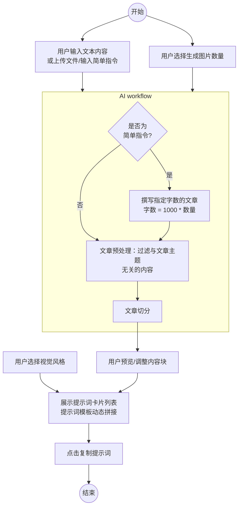

# AI 信息图提示词生成器 (Nano Info ) 产品需求文档 (PRD)

## 1. 产品概述
产品名称：Nano Info 

一款轻量化的 AI 工具，专注于将长文本、文件或创作指令转化为专业、用于绘图模型（Nano banana pro）的信息图绘图提示词。产品核心逻辑是通过集成化的 AI 工作流对内容进行生成、预处理与语义切分，并结合视觉风格库，通过动态模板拼接为每一组信息块生成精准的绘图 Prompt，帮助用户解决“有内容但不会写绘图描述”的痛点。

---

## 2. 功能点列表

### 2.1 内容输入与预设
- **多模态输入**：
    - **粘贴文本**：支持直接粘贴长篇文章。
    - **上传文件**：支持上传 PDF、Word、Markdown、TXT 等格式文件并提取文字。
    - **简单指令**：用户仅输入创作意向（如“写一篇关于量子力学的科普文章”）。
- **生成数量设置**：用户选择需要生成的图片总数（即最终切分的块数 N）。

### 2.2 AI 工作流 (AI Workflow)
- **全流程自动化**：系统将“内容生成、杂质过滤、语义切分”集成在一个 AI 任务中完成。
- **动态字数控制**：若检测到输入为简单指令，AI 将自动撰写文章，字数规模锁定在 N*1000字左右，确保内容深度。
- **智能化切分**：AI 自动过滤掉原文中无关的元数据或杂质，并按照逻辑维度将其精准拆分为 N 个独立的信息块。

### 2.3 视觉映射与提示词输出
- **内容块预览与调整**：展示切分后的文字块，支持用户直接进行二次编辑。
- **视觉风格选择**：提供风格库，用户选择期望的视觉表现。
- **提示词动态拼接**：系统将“调整后的内容块”作为变量，自动填入预设的“视觉风格模板”中，实时生成提示词列表。
- **提示词卡片展示**：以卡片流形式展示每一组生成的 Prompt，支持一键复制。

---

## 3. 用户故事
- **作为内容运营**，我有一篇 3000 字的深度调研报告，我想把它做成 3 张信息图。我上传了 PDF 文件，设置生成数量为 3。AI 自动过滤了报告中的页码和参考文献，将其切分为 3 个核心章节。我选择了“写实摄影”风格，系统立即生成了 3 组 Prompt。
- **作为自媒体博主**，我只有个模糊想法：“写一个关于猫咪演化史的内容”，我输入指令并选择生成 5 张图。AI 一次性完成了 5000 字的长文撰写，并将其拆解为 5 个演化阶段的内容块。

---

## 4. 相关业务流程



---

## 5. 关键 AI 系统提示词 (System Prompt)

### 5.1 内容处理统一工作流 (Unified Content Workflow)
```markdown
# Role
你是一个集资深作家、编辑与内容架构师于一身的 AI 专家。你擅长创作深度内容并将拆分为多个完整的信息块。

# Input
用户输入：{
instruction_type:完整文章|简单指令,
instruction:用户输入,
split_number:目标数量,
word_count:撰写文章字数
}

# Task


## Step 1: 意图识别与内容创作
- 如果`instruction_type`是简单指令，根据`instruction`撰写一篇`word_count`字的深度长文。得到文章`ariticle`。
- 内容要求：逻辑严密，文章的理论和依据都符合事实。
- 如果`instruction_type`是完整文章，则直接将原文流转到下一步。得到文章`ariticle`。
- 最终得到一篇文章：`ariticle`。

## Step 2: 内容预处理
- 识别并过滤掉`article`的所有干扰信息（如：无用链接、页码、页眉页脚、广告推广、参考文献列表、乱码字符等）。
- 其他内容不要改动。
- 得到文章：`clean_article`。

## Step 3: 语义切分
- 将`clean_article`切分为`split_number`个独立的部分。
- 切分原则：确保每个部分在语义上是完整的，逻辑上是连贯的。
- 零损耗：除了必要的开头和结尾语句改动外，不要改动`clean_article`原文。

# Output Format
请仅输出一个标准 JSON 字符串数组，数组长度必须等于`split_number`。
格式如下：
[
  "第一部分的内容全文...",
  "第二部分的内容全文...",
  ...
]
```

---

## 6. 产品交互设计

### 6.1 页面组织架构
网站由 1 个主页面构成：
- **输入区**：支持 Tab 切换输入模式，包含生成数量 $N$ 的选择器。
- **内容块编辑区**：AI 处理完成后，以卡片形式排列 $N$ 个文本块，用户可直接点击修改。
- **风格与结果区**：用户点击视觉风格标签后，内容块下方立即展示拼接好的 Prompt 卡片及一键复制按钮。

### 6.2 交互逻辑细节
1. **即时响应**：语义切分是核心 AI 耗时项，完成后进入本地处理模式。
2. **动态拼接**：提示词生成不消耗 API，通过前端逻辑将内容块与风格模板即时合成。
3. **容错处理**：如果 AI 返回的 JSON 数组长度不等于 $N$，系统将提示用户重试或允许用户手动拆分。

---

## 7. 技术选型方案

- **框架**: React 18 / Vite
- **状态管理**: Zustand
- **文件解析**: PDF.js / Mammoth.js (用于解析 PDF 和 Word)
- **UI 组件库**: Shadcn UI + Tailwind CSS
- **AI 交互**: OpenAI 兼容的API请求 (支持自定义 Base URL/API Key)
- **部署**: cloudflare
- UI风格：模仿anthropic的视觉设计规范